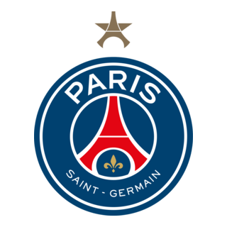

  
   
  
    
  
  &nbsp;&nbsp;
  

### 🚀 O que eu faço

- **⚙️ Back-end:** C# e NHibernate, integrações, lógica de negócios e arquitetura.
- **🎨 UI/UX:** Protótipos e componentes interativos no Figma, pensando na fluidez da experiência.
- **💻 Front-end:** React e Tailwind CSS, com foco em fidelidade visual e responsividade.
- **🧪 Qualidade:** Documentação técnica, testes e auditorias de qualidade ao longo do desenvolvimento.

### 🛠️ Stack

  
  
  
  
  
  

### ⚡ Fora do código

  <b>⚽ PSG desde criança</b> &nbsp;·&nbsp; <b>🎲 Fascinado por Baldur's Gate 3</b> &nbsp;·&nbsp; <b>🧙‍♂️ Magic: The Gathering (deck de Baldur's Gate☝️)</b>

